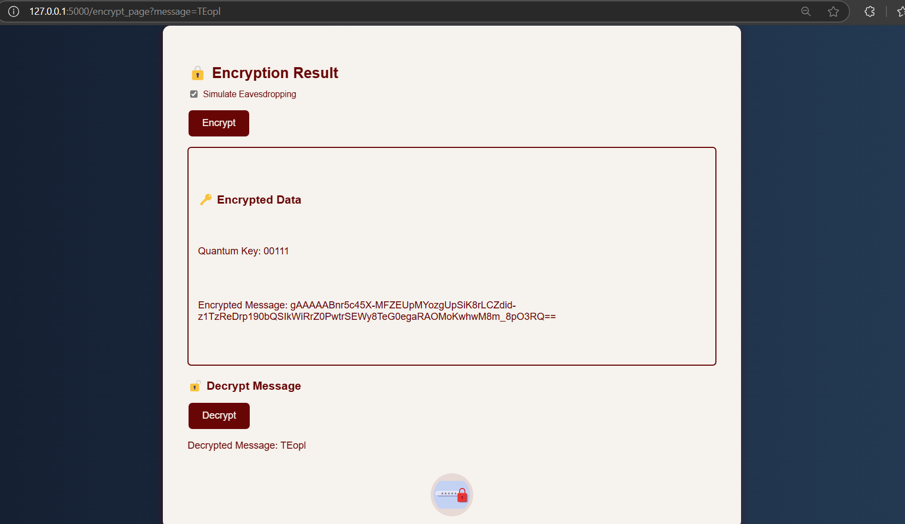

# QBits.io - Quantum Encryption Demo

QBits.io is a Flask-based project that demonstrates Quantum Key Distribution (QKD) using Qiskit.

## 🚀 Features
- Uses Qiskit for Quantum Key Distribution (QKD)
- Flask-based web application
- Simple encryption demonstration

## 📷 Screenshots
### 🔹 Project Output

### 🔹 Step-by-Step Implementation
1. Clone this repository:  
   git clone https://github.com/Yogitha-Turumella/QBits.io.git
2. Install required libraries:
   pip install -r requirements.txt
3. Run the application:
   python app.py

